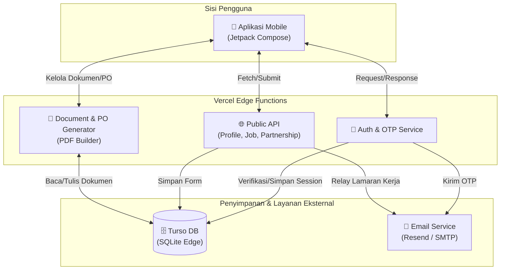
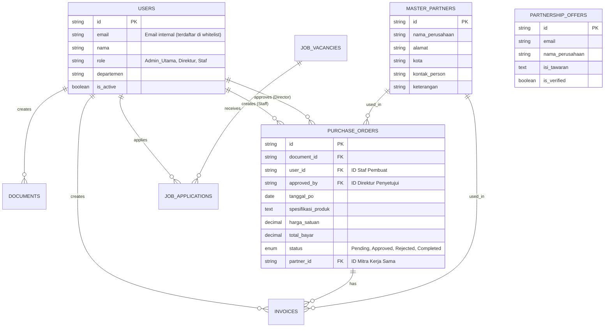

# PRD — Project Requirements Document

## 1. Overview
PT PRIMA ANDALAS ENERGI (PAE) membutuhkan sebuah aplikasi perusahaan yang berfungsi ganda: sebagai cerminan citra positif (profil publik) untuk meyakinkan calon mitra, supplier, investor, dan vendor; serta sebagai alat penunjang digitalisasi internal perusahaan. 

Aplikasi ini bertujuan untuk menggantikan proses manual dengan mengintegrasikan informasi profil utama (Tentang Kami, Visi-Misi), sistem penerimaan tawaran kerja sama yang aman dari *bot* (dengan verifikasi OTP), portal penerimaan lowongan pekerjaan langsung ke email, dan sistem manajemen dokumen internal (seperti pembuatan Purchase Order otomatis berformat PDF). Dengan sistem manajemen dokumen ini, arsip internal akan menjadi jauh lebih rapi dan dapat diakses oleh karyawan yang memiliki otorisasi kapan saja dan di mana saja.

## 2. Requirements
- **Hak Akses Berjenjang:** Terdapat area Publik (untuk mitra/pelamar kerja) dan area Internal (khusus karyawan terverifikasi). Akses fitur internal dibatasi berdasarkan peran (Admin Utama, Direktur, Staf).
- **Keamanan Anti-Bot:** Kolom pengisian "Tawaran Kerja Sama" harus diamankan pendaftarannya dengan validasi OTP menggunakan email.
- **Konsistensi Visual:** Desain UI/UX (antarmuka) aplikasi harus secara ketat menggunakan identitas warna dan panduan visual perusahaan (PT PAE).
- **Pengolahan Dokumen Internal:** Modul sistem informasi untuk membuat Purchase Order (PO) yang langsung dapat di-generate ke bentuk dokumen PDF.
- **Integrasi Email Praktis:** Pengiriman form lamaran pekerjaan dari aplikasi diteruskan langsung ke sistem email resmi perusahaan (HR/Admin).

## 3. Core Features

### Fase 1 (MVP Utama — Prioritas Tertinggi)
- **Profil Perusahaan** — Halaman utama yang menyajikan gambaran lengkap perusahaan agar mitra, investor, dan vendor yakin sebelum bekerja sama.
  - **Tentang Perusahaan** — Ringkasan sejarah dan bidang usaha PT PAE yang membangun kredibilitas (Teks bawaan: Perdagangan Umum, Pengadaan Barang, Distribusi, dll).
  - **Visi & Misi** — Menampilkan tujuan dan komitmen perusahaan sebagai fondasi kepercayaan.

- **Kontak & Lokasi** — Menampilkan informasi kontak resmi perusahaan (telepon, email, alamat) serta integrasi Google Maps untuk memudahkan mitra dan vendor mengunjungi kantor fisik PT PAE.

- **Formulir Kerja Sama** — Formulir publik yang memungkinkan calon mitra mengajukan kerjasama secara rapi dan tervalidasi OTP.
  - **Isi Formulir Tawaran** — Pengguna mengisi detail perusahaan dan kebutuhan kerjasama dengan mudah.
  - **Verifikasi OTP** — Email OTP mencegah robot agar hanya tawaran serius yang masuk.
  - **Kirim Tawaran** — Formulir terkirim langsung ke tim PAE untuk ditindaklanjuti.

### Fase 2
- **Lowongan Pekerjaan** — Halaman karir yang menampilkan lowongan serta mengirim lamaran langsung ke email perusahaan.
  - **Daftar Lowongan** — Kumpulan posisi yang sedang dibuka, langsung terlihat oleh pelamar.
  - **Detail Lowongan** — Deskripsi pekerjaan dan kualifikasi yang jelas bagi kandidat.
  - **Kirim Lamaran** — Form lamaran yang langsung mengirim data pelamar beserta dokumen pendukung ke email perusahaan.

- **Notifikasi Email Admin** — Sistem notifikasi otomatis yang mengirimkan pemberitahuan ke email administrator setiap kali ada tawaran kerja sama baru atau lamaran pekerjaan yang masuk untuk respon cepat.

### Fase 3
- **Login & Keamanan** — Akses eksklusif karyawan internal menggunakan email dan OTP untuk menjaga keamanan dokumen.
  - **Masuk dengan Email** — Karyawan memasukkan email untuk mendapatkan OTP akses.
  - **Verifikasi OTP** — Kode OTP memastikan hanya pengguna sah yang masuk ke area internal.
  - **Keluar Akun** — Mengakhiri sesi dengan aman agar dokumen tetap terlindungi.
- **Whitelist Management** — Sistem pengelolaan daftar email internal yang diizinkan untuk mengakses aplikasi guna mencegah akses dari pihak luar.
- **Audit Log Login** — Catatan riwayat aktivitas login yang mencakup waktu, identitas pengguna, dan informasi perangkat untuk keperluan pengawasan keamanan dan pertanggungjawaban.

- **Manajemen Role/Izin Akses (Governance)** — Sistem pengaturan hak akses pengguna berdasarkan peran untuk menjaga integritas data dan alur kerja:
  - **Admin Utama:** Memiliki otoritas penuh untuk mengelola konten profil perusahaan, memperbarui visi-misi, mengatur daftar lowongan kerja, mengelola **Whitelist Email** (menambah/menghapus personil yang diizinkan mengakses sistem), serta mengelola **Master Data Mitra Kerja Sama** (menambah, mengedit, menghapus data perusahaan mitra).
  - **Direktur:** Berperan sebagai otoritas pengambil keputusan tertinggi; memiliki hak eksklusif untuk melakukan peninjauan (review) dan memberikan persetujuan (**Approve/Reject**) pada draf Purchase Order yang diajukan staf, serta memantau **Dashboard Statistik/Analytics** untuk melihat performa bisnis secara real-time.
  - **Staf:** Berperan sebagai pelaksana operasional; memiliki izin untuk membuat draf dokumen operasional (**PO, Invoice, BAST, dan Surat Eksternal**) serta melakukan pelacakan (tracking) terhadap status dokumen yang sedang berjalan.

- **Database Mitra Kerja Sama (Master Data Awal)** — Basis data awal PT PAE yang berisi daftar entitas customer/vendor eksisting. Data ini digunakan sebagai referensi otomatis pada field “Pembeli” atau “Vendor” di modul Purchase Order, Invoice, dan BAST, sehingga tidak perlu mengetik ulang informasi perusahaan. 
  - **Manajemen Mitra (CRUD):** Admin Utama dapat menambah, mengedit, dan menghapus data mitra secara manual melalui antarmuka khusus. Setiap entri mitra memiliki field: Nama Perusahaan, Alamat, Lokasi (Kota), dan Kontak Person.
  - **Data Awal (Pre-seeded):** Daftar entitas kerja sama yang sudah tercatat sebagai referensi awal:
    1. **Perumda Dharma Jaya** (Jakarta Timur)
    2. **PT Sarana Bandar IndoTrading** (Jakarta Timur)
    3. **PT. Food Station Tjipinang Jaya** (Jakarta Timur)
    4. **PT Prabu Unggul Bersama** (Jakarta Selatan)
  - **Pemakaian di Modul Transaksional:** Saat membuat PO, Invoice, atau BAST, staf dapat memilih salah satu entitas dari daftar ini melalui dropdown; field alamat, kota, dan kontak person akan terisi otomatis sesuai data yang tersimpan. Penambahan mitra baru dapat dilakukan langsung oleh Admin Utama kapan saja.

- **Purchase Order** — Alat internal untuk membuat, memproses persetujuan, dan melacak purchase order.
  - **Buat PO Baru** — Form pengisian pesanan pembelian secara digital (informasi pemasok, barang, kuantitas). Detail wajib: Tanggal PO, Spesifikasi Produk, Harga Satuan (mengikuti Master Data/Intervensi Pemerintah), Satuan, Jumlah Total Barang, Total Bayar, Lokasi Pengiriman, Lokasi Penerima, Cara Pembayaran, Dokumen Pendukung Transaksi, dan Tanda Tangan Pembeli.
  - **Penomoran PO Otomatis** — Sistem penomoran otomatis dengan format terstandarisasi `[Urut]/PO_[SpesifikasiProduk]/PAE-[NamaPembeli]/[BulanRomawi]/[Tahun]` (contoh: `001/PO_BLD.BLP.KRK/PAE-KSP/VI/2026`).
  - **Alur Persetujuan (Approval Flow):** Setiap draf PO yang dibuat Staf akan muncul di antrean Direktur untuk status *Pending*. Direktur dapat melakukan *Approve* (menghasilkan tanda tangan digital dan nomor resmi) atau *Reject* (dengan catatan revisi).
  - **Pelacakan Status PO** — Memantau status setiap PO secara real-time (Pending, Approved, Sent to Vendor, Completed).
  - **Riwayat & Unduh PDF** — Akses ke arsip PO lama dan pembuatan dokumen PDF otomatis yang siap cetak.

- **Invoice** — Modul pembuatan Invoice yang terkait dengan Purchase Order.
  - **Buat Invoice** — Formulir pembuatan invoice dari PO yang sudah disetujui. Detail wajib: Tanggal Invoice, Jatuh Tempo (TOP), serta konfirmasi TTD End User dan Buyer.
  - **Penomoran Invoice Otomatis** — Format `[Urut]/INVOICE/PAE/[BulanRomawi]/[Tahun]`.
  - **Unduh PDF Invoice** — Generate invoice siap cetak dalam format PDF.

- **Berita Acara (BAST)** — Modul pembuatan Berita Acara Serah Terima (BAST) untuk setiap transaksi/PO.
  - **Buat BAST** — Form pembuatan BAST dengan penomoran otomatis format `[Urut]/BAST/PAE/[BulanRomawi]/[Tahun]`. Data diambil dari PO dan dilengkapi keterangan serah terima.
  - **Unduh PDF BAST** — Generate dokumen PDF siap unduh.

- **Surat Eksternal** — Modul penerbitan surat resmi keluar dengan penomoran sesuai divisi pengirim.
  - **Buat Surat Eksternal** — Form surat dengan template resmi, nomor surat otomatis format `[Urut]/PAE/[KodeDivisi]/[BulanRomawi]/[Tahun]`.
  - **Arsip & Unduh Surat** — Riwayat surat yang pernah diterbitkan dan unduh PDF.

- **Document Control (ISO)** — Manajemen dokumen standar internal (SOP, Formulir, Instruksi Kerja) dengan kode kontrol.
  - **Pembuatan Dokumen ISO** — Form untuk SOP, Formulir (FRM), dan Instruksi Kerja (IK) dengan format penomoran baku: `[Kode]-PAE-[Divisi]-[NomorUrut]`.
  - **Pengarsipan & Akses** — Dokumen tersimpan rapi dengan metadata.

- **Dashboard Admin & Analytics** — Panel kendali pusat sesuai peran:
  - **Manajemen Konten (Admin Utama):** Memperbarui informasi profil perusahaan dan inbox kerjasama.
  - **Statistik & Monitoring (Direktur):** Grafik ringkasan aktivitas operasional secara visual: jumlah PO per bulan, tren Invoice, status BAST, dan volume lamaran kerja. Menyajikan indikator kesehatan operasional perusahaan (Key Performance Indicator).

## 4. User Flow
1. **Flow Pengunjung Publik (Melihat Profil & Mengirim Tawaran):**
   - Pengguna membuka profil PT PAE > Pilih menu "Tawaran Kerja Sama" > Validasi OTP > Isi formulir detail tawaran > Submit.
2. **Flow Pelamar Kerja:**
   - Pengunjung memilih menu "Lowongan Pekerjaan" > Lihat rincian > Mengisi form dan lampiran > Kirim (langsung ke Email HR).
3. **Flow Karyawan Internal (Dokumen & PO):**
   - Karyawan login via Email & OTP (harus ada dalam Whitelist).
   - **Staf:** Memilih modul "Purchase Order" > Isi rincian > Pilih Mitra dari dropdown Database Master Data (jika tersedia) > Simpan sebagai draf (Status: Pending Approval).
   - **Direktur:** Melihat dashboard > Menu Approval > Tinjau draf PO > Klik "Approve" atau "Reject".
   - Setelah Approved, Staf dapat melakukan "Generate PDF" dan melanjutkan pembuatan Invoice/BAST.
4. **Flow Administrasi (Admin Utama):**
   - Admin Utama masuk ke Dashboard > Manajemen User > Kelola Whitelist Email untuk staf baru.
   - Admin Utama bisa mengelola Master Data Mitra: menambah, mengedit, atau menghapus data perusahaan mitra.
   - Admin Utama mengubah konten Visi-Misi di halaman publik jika ada perubahan kebijakan perusahaan.

## 5. Architecture
Aplikasi (Android native melalui Jetpack Compose) menjadi antarmuka utama. Backend Edge Functions menangani logika sistem, keamanan OTP, pembuatan PDF, dan relai Email, terhubung dengan Database Turso.

## 6. Database Schema
Skema mencakup alur persetujuan dan klasifikasi pengguna, serta tabel mitra kerja sama dengan field kontak person.

## 7. Tech Stack
- **Frontend:** Jetpack Compose (Modern toolkit standar Android).
- **Backend / API:** Edge Functions via Vercel.
- **Database:** Turso (Database SQL Serverless berskala Edge).
- **Layanan Tambahan:** 
  - *Email Gateway:* Resend atau SendGrid (OTP & Forwarding).
  - *PDF Generator:* Library native iText PDF (Android) atau Puppeteer pada backend untuk pembuatan dokumen PDF terstandarisasi.